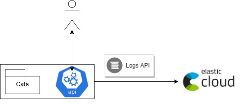
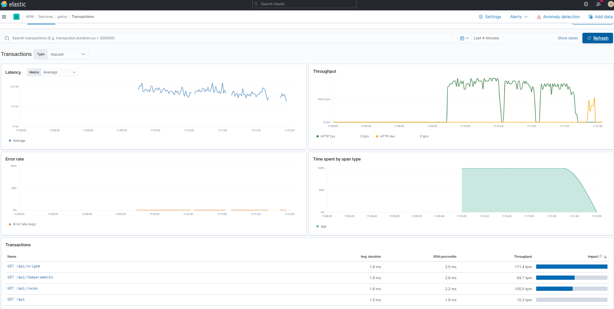
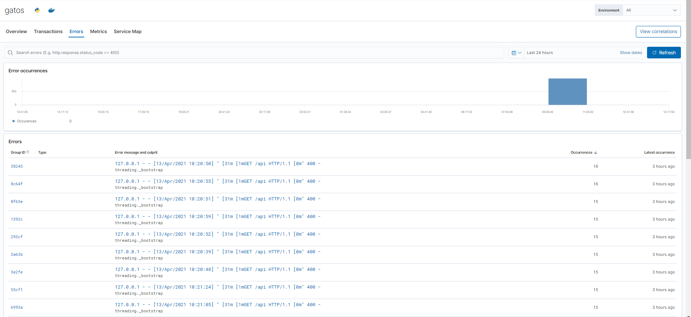
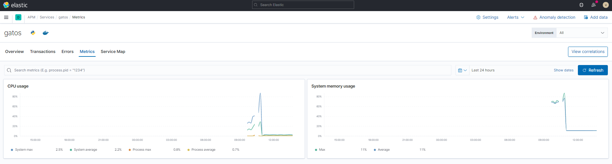
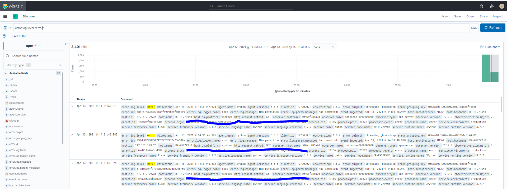
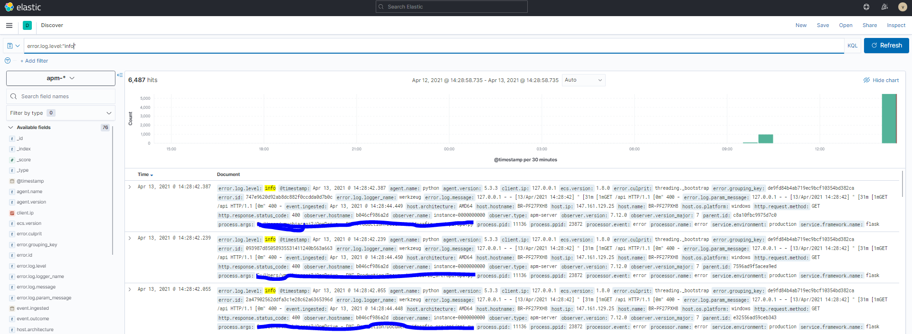
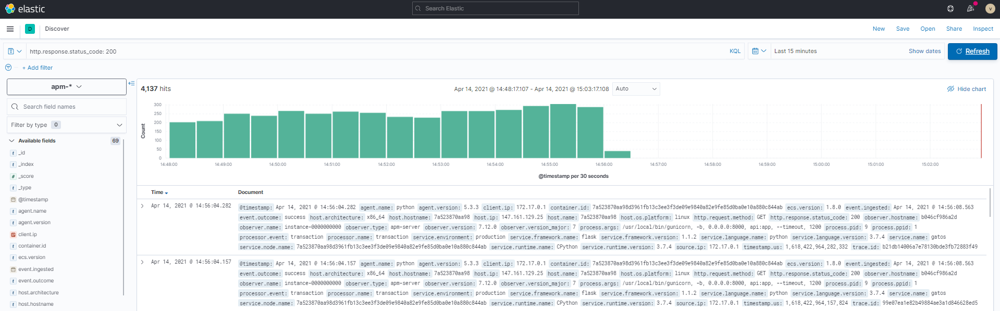
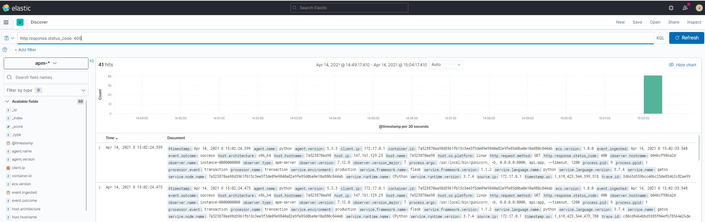

# SRE



- App

A aplicação consiste em uma classe CATS que busca dados the cat API(https://thecatapi.com) e insere os dados de interesse em um documento em memória e salva uma cópia deste em arquivo local.

- API

A api, por sua vez, importa a classe cats e utiliza o documento resultante como um banco de dados em memória.
A documentação da api pode ser encontrada [aqui](https://vimuchiaroni.github.io).
A API possui a funcionalidade de enviar métricas execução para um ELASTIC APM. Para verificar como habilitar essa função, veja [aqui](#Logs-e-métricas).
### Rodando localmente

- Opção A
    
    1. Utilizando docker, rode o container disponibilizado no DockerHub:
        ```
        # docker run -p 5000:8000 vimuchiaroni/desafio_sre:latest
        ```
    2. Acesse a API utilizando o endereço http://localhost:5000
        
- Opção B

    1. Clonar o projeto do Github:
        ```
        # git clone https://github.com/vimuchiaroni/desafio_sre
        ```
    2. Fazer o build da imagem localmente utilizando docker:
        ```
        # cd desafio_sre
        # docker build . -t desafio_sre:latest
        ``` 
    3. Rodar o container:
        ```
        # docker run -p 5000:8000 desafio_sre:latest
         ```   
    4. Acesse a API utilizando o endereço http://localhost:5000

- Opção C
    1. Clonar o projeto do Github:
        ```
        # git clone https://github.com/vimuchiaroni/desafio_sre
        ```
    2. Rode os codigos python diretamente do seu computador:
          ```
        #  cd desafio_sre
        # python api/api.py
         ```   
### Logs e métricas

É possivel conectar a API a um Elastic/APM server. Para isso, basta configurar a variável ELASTIC_SERVER. Caso haja um token de autenticação, é necessário também informar a variável ELASTIC_TOKEN durante o docker run.
   

        # docker run -p 5000:8000 -e ELASTIC_SERVER=<ELASTIC_ENDPOINT> -e ELASTIC_TOKEN=<ELASTIC_TOKEN> desafio_sre:latest

- Exemplo de Dashboards:







- Exemplos de query no Kibana







